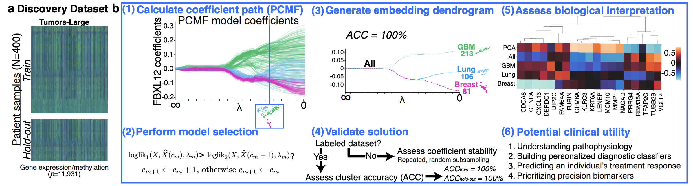

# PCMF, LL-PCMF, & P3CA: Simple and Scalable Algorithms for Cluster‑Aware Embedding

**PCMF** (Pathwise Clustered Matrix Factorization), **LL‑PCMF** (Locally Linear PCMF), **P3CA** (Pathwise Clustered Canonical Correlation Analysis), and **Consensus PCMF** are modular algorithms that combine low‑rank embedding with a convex clustering penalty to produce **cluster‑aware** low-rank representations for single‑view and two‑view data.

These methods are introduced in:  
**Amanda M. Buch, Conor Liston, Logan Grosenick.** *Simple and scalable algorithms for cluster‑aware precision medicine.* AISTATS 2024 (PMLR 238:136–144).  
Paper: https://proceedings.mlr.press/v238/buch24a.html



---

## Highlights
- **Pathwise solutions**: computes a full regularization path, yields interpretable hierarchically clustered embedding dendrograms, and selects the best penalty for cluster-aware low-rank representation of dataset/s.
- **Single‑view & multi‑view**: PCMF/LL‑PCMF for single‑view ("cluster-aware PCA/LLE"); P3CA for paired views ("cluster-aware CCA").
- **Consensus/batched mode** for larger datasets (PCMF method).
- **Fast implementations** with optional Numba and Cython; uses CHOLMOD (via `scikit-sparse`) for speed, warm-started ADMM (alternating direction method of multipliers), and Algorithmic Regularization (see Weylandt et al., 2020).
- **Consistent API** across models.

---

## Installation

### Managed install (conda/mamba + MOSEK + optional Cython)
Use the included installation helper script to set up an environment and (optionally) build the Cython extension:
```bash
bash install.sh
```
The script:
- creates a conda/mamba env (default: `pcmf_p3ca_env`, Python 3.8),
- installs the scientific stack + `cvxpy`, `numba`, `scikit-sparse`, etc.,
- installs `mosek`,
- checks for a MOSEK license at `~/mosek/mosek.lic,
    You must obtain a MOSEK license to use optimization features."
      1. Register for a free academic MOSEK license at:"
          https://www.mosek.com/license/request/?i=acp"
      2. Place your license file at: $MOSEK_LIC"
- installs this repository as a module in editable mode,
- optionally compiles Cythonized proximal operator `pcmf_p3ca.utils.admm_utils from pcmf_p3ca/utils/admm_utils.pyx` (options to use Python (slow) or Numba version (faster than Cython for datasets with a large number of variables) if not built).

Restarting the installation helper script:
- If you need to restart the script, you can remove and recreate the conda/mamba environment by:
    rm -vr pcmf_p3ca.egg-info pcmf_p3ca/__pycache__
    mamba env remove -n pcmf_p3ca_env -y # or conda env remove -n pcmf_p3ca_env -y
    mamba env list # or conda env list; to check that it is removed
    bash install.sh # re-run installer

- You can remove any files created by the setup_admm_utils.py with:
    rm -vrf build pcmf_p3ca.egg-info pcmf_p3ca/__pycache__ pcmf_p3ca/utils/admm_utils.c pcmf_p3ca/utils/admm_utils.*.so(N) pcmf_p3ca/utils/__pycache__
---

## Quickstart
```bash
mamba activate pcmf_p3ca_env
```
### 1) PCMF on single‑view data
```python
import numpy as np
from pcmf_p3ca import Loader1D, PCMF

# Toy synthetic data
X, true_clusters = Loader1D.generate_two_cluster_data(m=[60, 60], n_X=50, sigma=0.1)

# Regularization path
penalty_list = np.concatenate((np.repeat(np.inf,10),np.exp(np.linspace(-10,2.5,50))[::-1]),axis=0)

# Fit
model = PCMF(penalty_list=penalty_list, problem_rank=1, prox_method="c")
out = model.fit(X, true_clusters)

# Pathwise selection & labels
labels_path = model.select(trim_init_lambdas=2)
best_labels = model.return_labels(lam="best")

# Visualize the path
model.plot_path(plot_range=(0, -1))
```

### 2) LL‑PCMF (locally linear variant)

```python
import numpy as np
from pcmf_p3ca import Loader1D, LLPCMF

# Toy synthetic data
X, true_clusters = Loader1D.generate_two_cluster_data(m=[60, 60], n_X=50, sigma=0.1)

# Regularization path
penalty_list = np.concatenate((np.repeat(np.inf,10),np.exp(np.linspace(-10,2.5,50))[::-1]),axis=0)

# Fit
model = LLPCMF(penalty_list=penalty_list, prox_method="numba", non_negative=False)
out = model.fit(X, true_clusters, verb=False)

# Pathwise selection & labels
labels_path = model.select(trim_init_lambdas=2)
best_labels = model.return_labels(lam="best")

# Visualize the path
model.plot_path(plot_range=(0, -1))
```

### 3) P3CA on paired (X, Y) views
```python
import numpy as np
from pcmf_p3ca import Loader2D, P3CA

# Paired synthetic data (or use Loader2D.load_penguins_data())
X, Y = Loader2D.load_syntheticXY(m=120, n_X=20, n_Y=20, sigma=0.1)
true_clusters = np.repeat([0, 1], 60)

# Regularization path
penalty_list = np.concatenate((np.repeat(np.inf,10),np.exp(np.linspace(-10,2.5,50))[::-1]),axis=0)

# Fit
model = P3CA(penalty_list=penalty_list, admm_iters=2, cca_iters=3, prox_method="numba")
out = model.fit(X, Y, true_clusters)

# Pathwise selection & labels
labels_path = model.select(trim_init_lambdas=2)
best_labels = model.return_labels(lam="best")

# Visualize the path
model.plot_path(plot_range=(0, -1))
```

### 4) Consensus PCMF (mini-batches)
```python
import numpy as np
from pcmf_p3ca import Loader1D, ConsensusPCMF

# Toy synthetic data
X, true_clusters = Loader1D.generate_two_cluster_data(m=[60, 60], n_X=50, sigma=0.1)

# Regularization path
penalty_list = np.concatenate((np.repeat(np.inf,10),np.exp(np.linspace(-10,2.5,50))[::-1]),axis=0)

model = ConsensusPCMF(penalty_list=penalty_list, split_size=64, prox_method="numba")
out = model.fit(X, true_clusters)

# Pathwise selection & labels
labels_path = model.select(trim_init_lambdas=2)
best_labels = model.return_labels(lam="best")

# Visualize the path
model.plot_path(plot_range=(0, -1))
```

See `example_notebook.ipynb` for an end‑to‑end walkthrough.

```bash
mamba activate pcmf_p3ca_env
jupyter notebook example_notebook.ipynb
```
---

## API Overview

All model classes share a consistent interface:

- `fit(...)` → runs the pathwise solver; stores path variables in lists  
- `select(labels_true=None, trim_init_lambdas=2)` → spectral clustering along the path; sets `best_lam`  
- `return_fit(lam=None | "best")` → returns variables for one λ (or the entire path)  
- `return_labels(lam=None | "best")` → returns labels at one λ (or all)  
- `plot_path(plot_range=(0, -1))` → quick path solution visualization of interpretable hierarchally clustered dendrogram

Classes:
- `PCMF`: pathwise clustered matrix factorization with convex clustering penalty  
- `LLPCMF`: locally linear variant of PCMF (used a Penalized Alternating Least Squares approach with convex clustering for `u` + ADMM for `V`)  
- `P3CA`: pathwise clustered canonical correlation analysis  
- `ConsensusPCMF`: batched/consensus variant of PCMF

---

## Data Utilities

- `Loader1D`: synthetic single‑view generators + CSV loader  
  - `generate_two_cluster_data(...)`  
  - `generate_cluster_PMD_data(...)`  
  - `generate_PMD_data(...)`  
  - `load_custom_file(...)`  

- `Loader2D`: paired (X, Y) generators + Penguins dataset helper  
  - `load_penguins_data(...)` (requires `palmerpenguins`)  
  - `load_syntheticXY(...)`  
  - `load_custom_paired_files(...)`  

---

## Tips & Troubleshooting

- **MOSEK**: MOSEK is required, put your license at `~/mosek/mosek.lic`.  
- **CHOLMOD (`scikit-sparse`)**: provides big speed‑ups. 
- **Cython extension**: if `admm_utils` fails to build, the code transparently falls back to Numba/Python implementations.

---

## Citing
If you use this package, please cite:

> **Amanda M. Buch, Conor Liston, Logan Grosenick.**  
> *Simple and scalable algorithms for cluster‑aware precision medicine.*  
> AISTATS 2024, PMLR 238:136–144.  
> https://proceedings.mlr.press/v238/buch24a.html

```bibtex
@InProceedings{pmlr-v238-buch24a,
  title = {Simple and scalable algorithms for cluster-aware precision medicine},
  author = {Buch, Amanda M. and Liston, Conor and Grosenick, Logan},
  booktitle = {Proceedings of The 27th International Conference on Artificial Intelligence and Statistics},
  pages = {136--144},
  year = {2024},
  editor = {Dasgupta, Sanjoy and Mandt, Stephan and Li, Yingzhen},
  volume = {238},
  series = {Proceedings of Machine Learning Research},
  publisher = {PMLR},
  url = {https://proceedings.mlr.press/v238/buch24a.html}
}
```

---

## License
This repository is distributed under an **“Other/Proprietary (see license file)”** license. See `LICENSE` for details.

THIS SOFTWARE IS PROVIDED "AS IS", WITHOUT WARRANTY OF ANY KIND, EXPRESS OR IMPLIED, INCLUDING
BUT NOT LIMITED TO THE WARRANTIES OF MERCHANTABILITY, FITNESS FOR A PARTICULAR PURPOSE AND
NONINFRINGEMENT. IN NO EVENT SHALL THE AUTHORS OR COPYRIGHT HOLDERS BE LIABLE FOR ANY CLAIM,
DAMAGES OR OTHER LIABILITY, WHETHER IN AN ACTION OF CONTRACT, TORT OR OTHERWISE, ARISING FROM,
OUT OF OR IN CONNECTION WITH THE SOFTWARE OR THE USE OR OTHER DEALINGS IN THE SOFTWARE.

Third-party components are licensed separately:
- CVXPY — Apache-2.0
- scikit-learn — BSD-3-Clause
- NumPy — BSD-3-Clause
- SciPy — BSD-3-Clause
- MOSEK — Commercial license required

## Acknowledgments
Built on `numpy`, `scipy`, `scikit-learn`, `cvxpy`, with optional acceleration via `numba`/Cython and sparse linear algebra via `scikit-sparse`.
